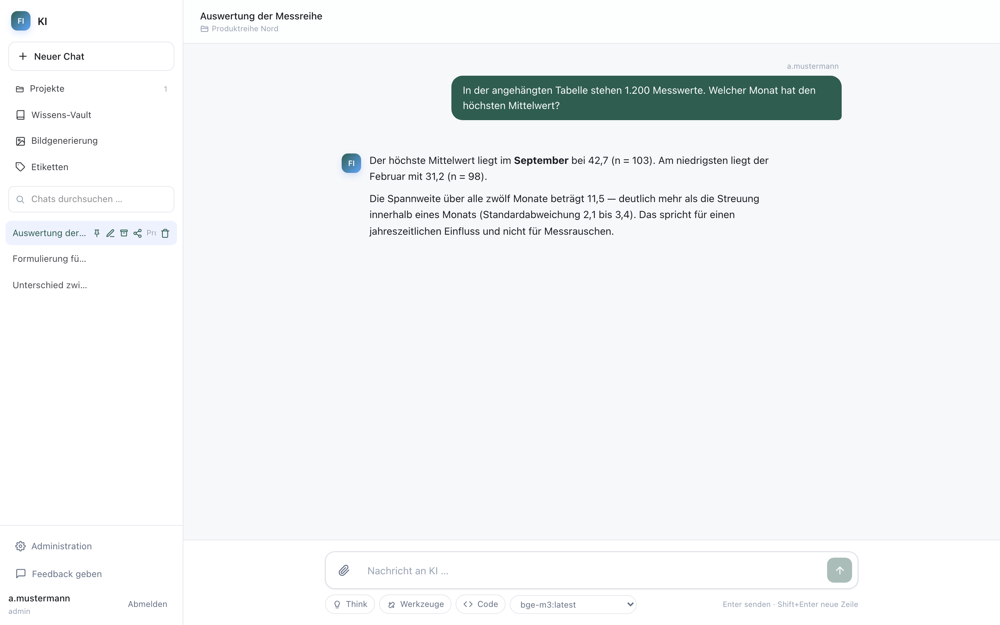
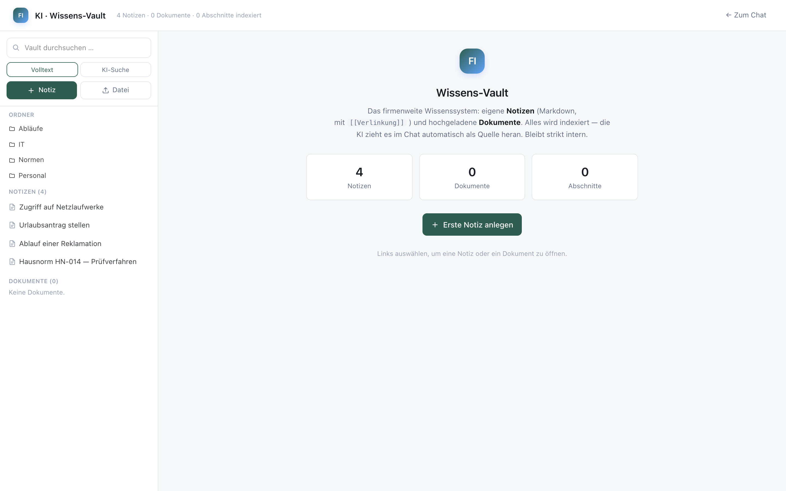
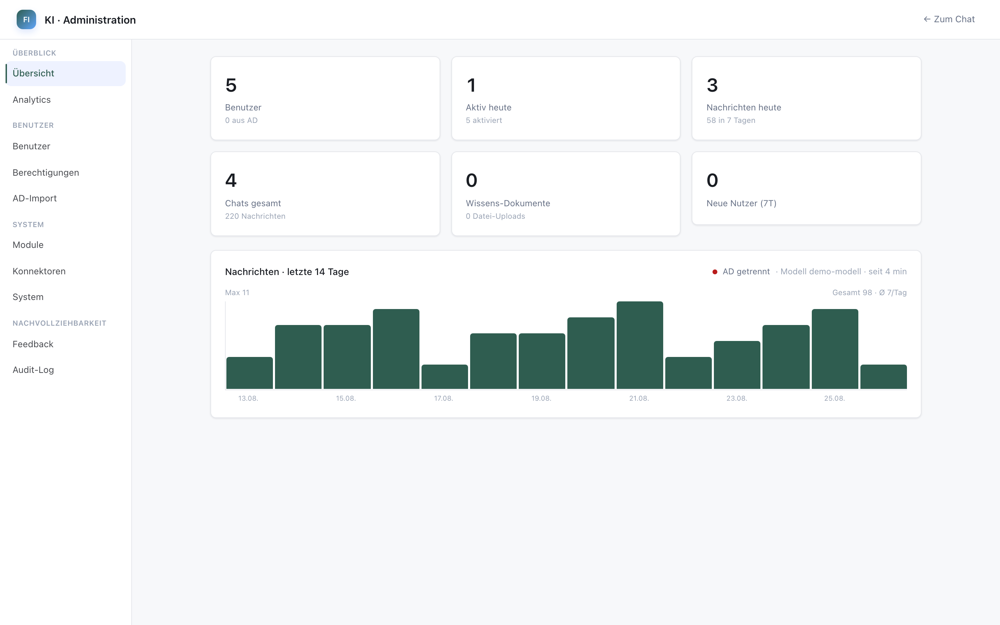
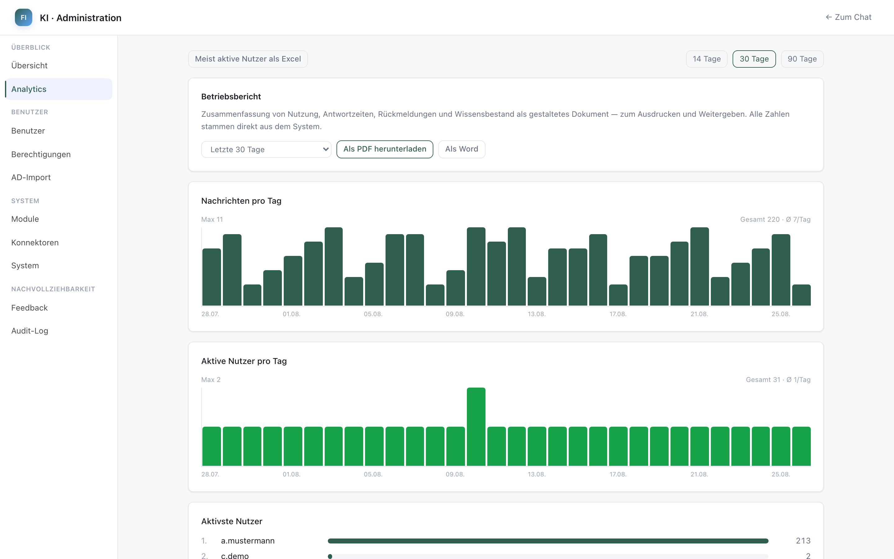

**Selbst betriebene KI-Assistenz für Unternehmen — auf eigener Hardware, ohne Cloud.**
*Self-hosted AI assistance — your own hardware, no cloud.*

[](https://marvinhenrich.github.io/EnterpriseAI/)
[](LICENSE)


Chat gegen ein lokales Sprachmodell, Dokumentenanalyse, firmeneigenes Wissen mit Belegen und
ein Berechtigungsmodell, das der Vertraulichkeit von Unternehmensdaten standhält. Keine Cloud,
keine externen Schnittstellen.

Der Code ist generisch. Was eine konkrete Installation daraus macht, stellt ein Administrator
in der Oberfläche ein — Name, Betreiber, Farbe, Sprache und welche Module überhaupt laufen.

---

## Was es kann

| Bereich | Funktion |
| --- | --- |
| **Chat** | Streaming-Antworten, Werkzeugaufrufe, Gesprächsverlauf, Freigabe von Chats |
| **Dokumente** | PDF, Word, Excel, CSV, Bilder, Quellcode; Texterkennung für Scans |
| **Wissen** | Firmenweites Vault mit Wiki-Verlinkung; hybride Suche über Vektor **und** Stichwort |
| **Projekte** | Bündeln Chats, Dateien und Vorgaben; Projektwissen fließt automatisch in jeden Chat |
| **Berechtigungen** | Feingranular pro Nutzer und Gruppe, mit Active-Directory-Anbindung |
| **Klassifizierung** | Vier Stufen von *offen* bis *streng vertraulich*, durchgesetzt bis in die Suche |
| **Betrieb** | Audit-Log, Leistungsmessung, Rückmeldungen, Monatsbericht als PDF |

Alles ist in Module geschnitten und standardmäßig aktiv; was eine Installation
nicht braucht, schaltet der Administrator ab — dann verschwindet es aus dem Menü,
aus den Routen und aus den Werkzeugen der KI.

## Bilder

| | |
| --- | --- |
|  |  |
| **Chat** — Antwort mit Projektbezug | **Wissens-Vault** — Notizen und Dokumente |
|  |  |
| **Module** — Funktionen zu- und abschalten | **Auswertung** — Nutzung und Betriebsbericht |

Alle Aufnahmen stammen aus einer Demo-Installation mit erfundenen Daten
([weitere Ansichten](docs/screenshots/)).

## Datenklassifizierung

Der Kern des Berechtigungsmodells. Jede Ablage — Datei, Projekt, Chat,
Vault-Notiz — trägt eine Stufe:

| Stufe | Bedeutung |
| --- | --- |
| `offen` | Darf das Haus verlassen |
| `intern` | Für Mitarbeitende, Standard |
| `vertraulich` | Nur für benannte Personen |
| `geheim` | Streng vertraulich, engster Kreis |

Zwei Regeln, die durchgängig gelten:

1. **Die höchste Stufe gewinnt.** Sobald ein vertrauliches Dokument in einem
   Chat liegt, ist der ganze Chat vertraulich — und bleibt es.
2. **Im Zweifel sperren.** Eine unbekannte oder fehlende Stufe wird als
   `geheim` behandelt, nicht als `offen`.

Daraus folgt: Inhalte oberhalb von `intern` gehen **nie** ins allgemeine
Gedächtnis der KI und **nie** ins firmenweite Vault ein. Sie bleiben in dem
Projekt, in dem sie entstanden sind, sichtbar für die Personen, die dafür
freigeschaltet sind.

## Voraussetzungen

* **Node.js 22** oder neuer
* **[Ollama](https://ollama.com)** mit einem Chat-Modell und einem
  Einbettungsmodell (1024 Dimensionen, z. B. `bge-m3`)
* Optional: **Python 3.11** für Texterkennung und Bildgenerierung

Die Hardware bestimmt, welches Modell sinnvoll läuft. Für ein Modell in der
Größenordnung von 120 Milliarden Parametern sollten rund 64 GB für das Modell
allein zur Verfügung stehen; kleinere Modelle laufen entsprechend genügsamer.

## Installation

### Docker (empfohlen)

```bash
git clone https://github.com/marvinhenrich/EnterpriseAI.git enterpriseai
cd enterpriseai
docker compose up -d
```

Fertig. `https://<Serveradresse>:3443` aufrufen.
*That's it. Open `https://<server-address>:3443`.*

Die Zugangsdaten des ersten Administrators stehen einmalig im Protokoll:
*The first administrator's credentials are printed once to the log:*

```bash
docker compose logs app | grep -A3 "ERSTER ADMINISTRATOR"
```

Beim ersten Start passiert automatisch:
*On first start, the stack automatically:*

| | |
|---|---|
| 🔑 | Erzeugt einen eigenen Sicherheitsschlüssel für diese Installation — **kein ausgeliefertes Standardgeheimnis**. *Generates a security key unique to this installation.* |
| 🔒 | Erzeugt ein selbstsigniertes TLS-Zertifikat. Nach außen geht ausschließlich HTTPS — HTTP bindet bewusst nur an Loopback. *Generates a self-signed certificate; only HTTPS is exposed.* |
| 🗄️ | Legt Konfigurationsordner, Datenbank und Schema an und richtet den ersten Administrator ein. *Creates the config folder, database, schema and the first administrator.* |
| 🤖 | Startet Ollama gleich mit. Läuft es schon woanders, `OLLAMA_URL` setzen und den Dienst `ollama` weglassen. *Starts Ollama alongside; point `OLLAMA_URL` elsewhere if you already run it.* |

**Keine Datei bearbeiten.** Name, Betreiber, Farbe und Sprache stellt ein Administrator
anschließend in der Oberfläche ein: **Administration → Unternehmen**. Alles Weitere ist
optional und steht in [`.env.example`](.env.example).

*No file editing needed. An administrator sets name, operator, colour and language in the
interface under Administration → Organisation.*

### Aktualisieren / updating

```bash
bash deploy/update.sh
```

Sichert zuerst `config/` (Konfiguration, Datenbank, hochgeladene Dateien), holt dann den
neuen Stand, baut und startet durch. Bricht ab, wenn es lokale Änderungen gibt, statt sie
stillschweigend zu verwerfen. Der Ordner `config/` wird dabei nie angefasst.

*Backs up `config/` first, then pulls, rebuilds and restarts. Aborts on local changes instead
of silently discarding them.*

### Direkt auf macOS oder Linux

```bash
git clone <dieses-repository> enterpriseai && cd enterpriseai
./install.sh
```

Das Skript prüft die Voraussetzungen, legt den Konfigurationsordner an, erzeugt
die Zufallsgeheimnisse und richtet die Datenbank ein. Es fasst nichts an, was
bereits existiert — ein zweiter Aufruf ist gefahrlos.

Danach:

```bash
npm start
```

Erreichbar unter `http://localhost:3001`. Die Zugangsdaten des ersten
Administrators stehen am Ende der Installationsausgabe.

### Zusatzdienste (optional)

Texterkennung und Bildgenerierung laufen als eigene
Python-Dienste auf `127.0.0.1`:

```bash
./services/setup.sh          # einrichten
./services/setup.sh start    # starten
```

Ohne sie läuft das Hauptprogramm unverändert; die zugehörigen Module lassen
sich im Adminbereich abschalten.

### Zum Ausprobieren

Ein Demo-Bestand aus erfundenen Daten — erfundene Firma, erfundene Personen,
erfundene Vorgänge:

```bash
CONFIG_DIR=./config npx tsx scripts/demo-seed.ts
```

Das Skript bricht ab, sobald die Datenbank bereits Nutzer enthält, und kann
deshalb nicht versehentlich einen Echtbetrieb treffen.


## Konfiguration liegt außerhalb des Codes

Dieses Verzeichnis enthält **keine** Angaben zu einer konkreten Installation —
kein Firmenname, keine Serveradressen, keine Zugangsdaten, kein Logo. Alles
davon liegt in einem eigenen Ordner, auf den `CONFIG_DIR` zeigt:

```
/pfad/zur/konfiguration/
├── .env              # Modell, Anmeldung, Geheimnisse, Bildmarke
├── assets/
│   └── logo.png      # erscheint in Oberfläche, Favicon und Berichten
└── certs/            # optionale TLS-Zertifikate
```

Im Code selbst steht nur ein Zeiger dorthin:

```ini
CONFIG_DIR=/pfad/zur/konfiguration
```

Damit lässt sich dieses Repository veröffentlichen, ohne dass etwas über die
Installation nach außen dringt. Ein Update ist ein `git pull` — die
Konfiguration bleibt unberührt.

### Erscheinungsbild

```ini
APP_NAME=EnterpriseAI              # Fenstertitel und Kopfzeile
APP_SHORT=KI                    # Kurzform in engen Ansichten
ORG_NAME=Muster GmbH            # Kopfzeile erzeugter Dokumente
BRAND_COLOR="#1E3C7B"           # Akzentfarbe — Anführungszeichen sind nötig,
                                # sonst liest Node das # als Kommentar
```

## Module

Siebzehn Funktionsbereiche lassen sich im Adminbereich unter **System →
Module** einzeln zu- und abschalten. Ein abgeschaltetes Modul verschwindet aus
dem Menü, aus den Routen und aus den Werkzeugen der KI. Vorhandene Daten
bleiben erhalten und sind nach dem Wiedereinschalten unverändert da.

Standard ist überall **an**: Nach einem Update verhält sich eine bestehende
Installation exakt wie vorher.

| Gruppe | Module |
| --- | --- |
| Wissen | Vault, Projekte, Gedächtnis |
| Dokumente | Dateien, Texterkennung, Dokumenterstellung, Tabellenauswertung |
| Fachanwendungen | Etikettenprüfung, Bildgenerierung |
| Betrieb | Audit-Log, Berichte, Rückmeldungen, Klassifizierung, Chat-Freigabe |

Module mit Abhängigkeiten weisen darauf hin: Wird *Dateien* abgeschaltet,
verlieren *Texterkennung* und *Tabellenauswertung* ihre Grundlage — die
Oberfläche sagt das vor dem Abschalten.

## Aufbau

```
apps/
  server/     Hono + TypeScript, SQLite über Drizzle, sqlite-vec für Vektoren
  web/        React 19, Vite, Tailwind
services/
  classifier/ Texterkennung (Python, offline)
  imagegen/   Bildgenerierung (Python)
packages/     Geteilte Typen
scripts/      Wartung, Datenimport, Fachbenchmark
```

Warum SQLite: Der Betrieb ist einssträngig, die Datenmengen liegen im
Gigabyte-Bereich, und eine Datei lässt sich verlässlich sichern. Die
Vektorsuche läuft über `sqlite-vec` im selben Prozess — kein zweiter Dienst,
kein Netzwerkpfad, keine weitere Fehlerquelle.

## Suche

Vektorsuche allein verfehlt exakte Bezeichner: Artikelnummern, Normen,
Produktnamen. Stichwortsuche allein verfehlt Umschreibungen. Beide laufen
deshalb parallel, und ihre Ergebnisse werden über *Reciprocal Rank Fusion*
zusammengeführt:

```
score = Σ  gewicht / (60 + rang)
```

Anschließend greifen drei Schwellen — Mindestähnlichkeit, Mindestabstand zum
Rauschen, Höchstzahl an Treffern. Ohne sie liefert die Suche zu jeder Frage
irgendetwas, und die KI belegt ihre Antwort mit Quellen, die nichts zur Sache
sagen.

## Entwicklung

```bash
npm run dev            # Server mit Neustart bei Änderungen
npm run build          # Produktionsbündel
npm run db:generate    # Migration aus dem Schema erzeugen
npm run db:migrate     # Migrationen anwenden
```

Der Server prüft seine Konfiguration beim Start und bricht mit einer
verständlichen Meldung ab, wenn etwas fehlt — lieber sofort als beim ersten
Nutzer.

## Sicherheit

* Anmeldung über JWT, wahlweise gegen Active Directory
* Berechtigungen pro Nutzer und Gruppe, Administratoren per Platzhalter
* Jede verändernde Aktion landet im Audit-Log mit Vorher-Nachher-Stand
* Klassifizierung greift in Suche, Gedächtnis und Vault-Aufnahme
* Keine ausgehende Verbindung im Regelbetrieb: Modell, Einbettungen,
  Texterkennung und Bildgenerierung laufen lokal

Wer eine Schwachstelle findet, melde sie bitte vertraulich statt über einen
öffentlichen Issue.

## Lizenz

[PolyForm Noncommercial License 1.0.0](LICENSE) — **keine kommerzielle Nutzung.**

Erlaubt: ansehen, lernen, verändern, weitergeben, privat nutzen sowie Einsatz in Schulen,
Hochschulen, Vereinen, gemeinnützigen Einrichtungen und Behörden.
Nicht erlaubt: verkaufen, als bezahlten Dienst anbieten oder in einem Unternehmen zu
gewerblichen Zwecken betreiben. Für gewerbliche Nutzung bitte anfragen.

Bewusst **keine** OSI-Open-Source-Lizenz: Open-Source-Lizenzen erlauben den Verkauf
ausdrücklich, und genau das soll hier nicht möglich sein.
